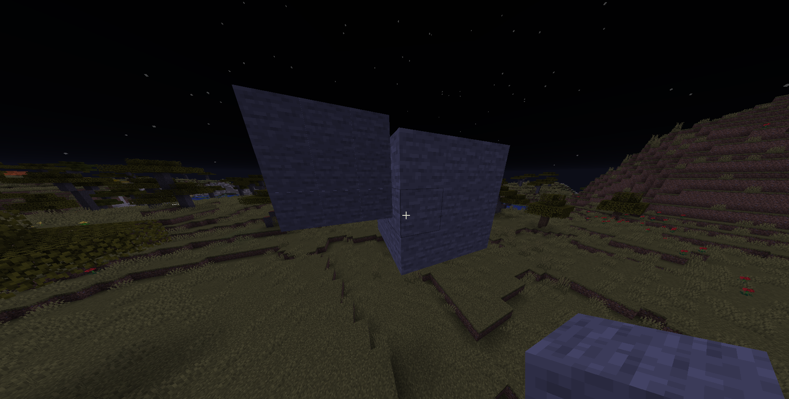

# Miniatures
Miniature library for Spigot/PaperMC (Anything based on Bukkit API)-

### What is miniature?
Miniature is a world area that is instead of blocks, represented on heads of armorstands.




# For devs
### Usage:
```java 

World world = /*world*/;
Vector mostPos = new Vector(10f, 10f, 10f); // most high position in world 
Vector leastPos = mostPos.clone().multiply(0.5f);   // least high position in world
boolean small = false; // 

Miniature.Builder builder = MiniatureAPI.areaToMiniature(world, mostPos, leastPos, small);
Miniature built = builder.get();

Vector offset = new Vector(1, 1, 1);
// list all part positions, and put them to world
built.getPositions().forEach((index, part) -> {
    part.setOffset(offset);
    Vector relPos = part.getRelativePos(); // get relative pos in world
    Vector realPos  = mostPos.clone().add(relPos); // add origin to relative pos
    
    // todo vector to location
    //      get block and set its type to `part.getMaterial();`
    
});
```
### Maven dependency
Repository:
```xml
<repository>
    <id>karyon</id>
    <url>http://nexus.realmland.eu/nexus/content/repositories/karyon/</url>
</repository>
```
Dependency:
```xml
<dependency>
  <groupId>xyz.rgnt</groupId>
  <artifactId>miniatures</artifactId>
  <version>1.0-alpha</version>
</dependency>
```


### Compiling
This project requires [lombok plugin](https://plugins.jetbrains.com/plugin/6317-lombok/) for getter/setter code generation and is compiled via [Apache Maven](https://maven.apache.org/). 
We use [Jetbrains annotations](https://mvnrepository.com/artifact/org.jetbrains/annotations/16.0.1) for javadoc code documentation & inspection.
Project can be compiled with shell script `./miniatures-build`. Resulting JAR file can be found in directory `target/miniatures-{VERSION}-{BUILD TYPE}.jar`

### Contributors
- *Project owner & developer*: [**rgnt**](https://rgnter.github.io)
